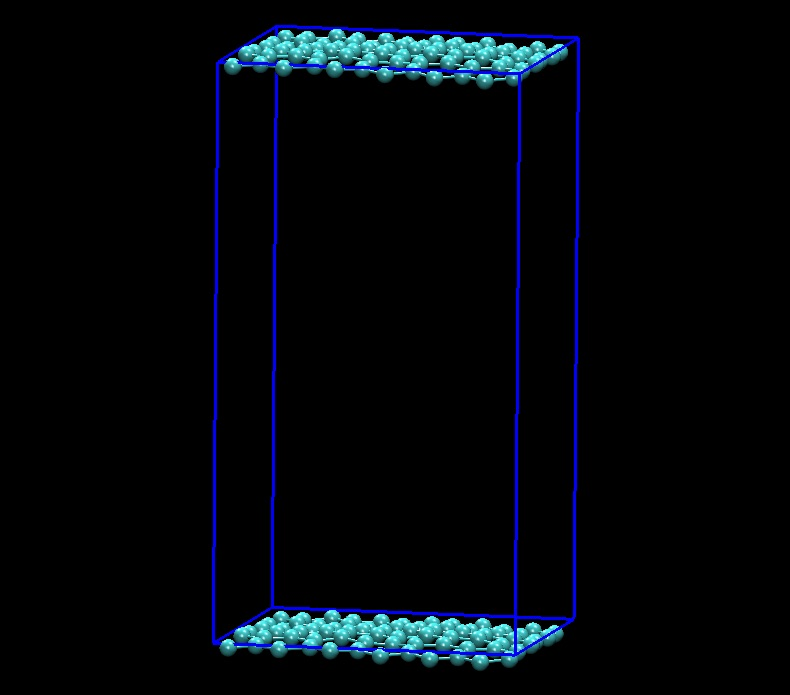
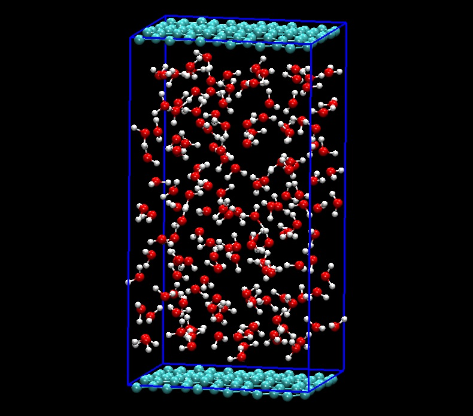

## Where did my water molecules go?

In computational chemistry, periodic boundary conditions are often used to avoid edge effects. 
Water molecules are often bound in a box that is periodically replicated. If an atom moves out of the box in one direction it enters through the opposite direction. 

For visualization this can cause problems, with water molecules broken up. 

They can also move out of the box so the box looks empty:

After running this python script I get:

